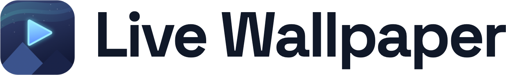

<div align="center">

<picture>
  <source media="(prefers-color-scheme: dark)" srcset="docs/assets/logo.png" />
  
</picture>

**YouTube をそのまま、Mac のライブ壁紙に。**

[](https://github.com/oniPhantom/local-live-wallpaper/actions/workflows/ci.yml)
[](https://github.com/oniPhantom/local-live-wallpaper/releases/latest)
[](#動作環境)
[](Package.swift)
[](LICENSE)

日本語 | [English](README.en.md)


</div>

YouTube の動画・プレイリストを macOS のデスクトップ壁紙として再生するツールです。
Chrome 拡張の「壁紙にする」ボタン、メニューバー、デスクトップ上の操作パネルから操作できます。

## ✨ 特徴

- 🖥 **YouTube をそのまま再生** — watch ページを表示するため、Premium ログインで広告なし
- 🖱 **Chrome からワンクリック** — YouTube の動画・再生リストページから即壁紙化
- 🎛 **操作パネル** — URL 再生・ログイン中アカウントの再生リスト選択・再生/一時停止・前後スキップ・音量・シーク・画質・時刻表示（ドラッグで移動可）
- ⌨️ **グローバルホットキー** — ⌃⌥P で再生 / 一時停止（他アプリ使用中でも有効）
- 🎞 **ローカル動画対応** — mp4 / mov / m4v をループ再生（YouTube 非依存・オフライン可）
- 🔋 **電力に配慮** — 画面ロック・全面被覆・バッテリー駆動・低電力モード時は自動で一時停止
- 🛟 **自動復帰** — 再生失敗時は内蔵アニメーション壁紙にフォールバックして自動リトライ

> ⚠️ 本ツールは個人利用を想定しています。YouTube のページ表示を変更して
> 動画のみを表示するため、利用は自己責任でお願いします。

## 目次

- [インストール](#-インストール)
- [使い方](#-使い方)
- [表示・動作の設定](#️-表示動作の設定)
- [アンインストール](#-アンインストール)
- [コマンド仕様（Native Messaging）](#-コマンド仕様native-messaging)
- [仕組み](#-仕組み)
- [既知の制限](#️-既知の制限)
- [コントリビュート](#-コントリビュート)
- [ライセンス](#-ライセンス)

## 🚀 インストール

### 動作環境

- macOS 13 以降（Apple Silicon / Intel）
- Xcode Command Line Tools（`xcode-select --install`）
- Google Chrome（拡張から操作する場合）

### ワンコマンド（推奨）

```bash
/bin/zsh -c "$(curl -fsSL https://raw.githubusercontent.com/oniPhantom/local-live-wallpaper/main/scripts/bootstrap.sh)"
```

`~/local-live-wallpaper` に clone してビルド・インストールまで自動で行います。
**あなたの Mac 上でビルドするため、署名・公証（Apple Developer Program）は不要です。**

### Homebrew

GitHub Releases のビルド済み zip を Homebrew Cask で入れることもできます
（tap・リリース公開後に利用可能。詳細は [docs/RELEASING.md](docs/RELEASING.md)）:

```bash
brew tap oniPhantom/tap
brew install --cask live-wallpaper
```

リリース zip が署名・公証されていない場合は初回起動時に Gatekeeper の警告が
出るため、その場合は上記のローカルビルドを推奨します。

### 手動セットアップ

```bash
git clone https://github.com/oniPhantom/local-live-wallpaper.git
cd local-live-wallpaper

# ビルドして /Applications へインストール(Native Messaging host 設定も自動)
make install
```

> ⚠️ `swift build` / `swift test` が `Invalid manifest` で失敗する場合は
> Command Line Tools 側の SPM が壊れています。Xcode をインストール済みなら
> `sudo xcode-select -s /Applications/Xcode.app` で切り替えてください
> (`install.sh` / `release.sh` / `make test` は Xcode があれば自動フォールバックします)。

### Chrome 拡張を読み込む（拡張から操作したい場合）

1. `chrome://extensions` を開き、右上の「デベロッパー モード」を ON
2. 「パッケージ化されていない拡張機能を読み込む」で `chrome-extension/` フォルダを選択
   （拡張 ID は manifest の `key` で固定されているため、追加の設定は不要）

### YouTube にログインする（推奨・広告なしになる）

1. メニューバーの ▶ アイコン →「YouTube にログイン…」
2. 開いたウィンドウでログイン（Cmd+C / Cmd+V 使用可）して閉じる

## 🎮 使い方


- **Chrome から**: YouTube の動画・playlist ページ右下の「🖥 壁紙にする」ボタン、
  またはツールバーの拡張アイコンの popup
- **メニューバー**: 再生操作、パネル表示切替、モニター設定、表示モード、ログイン
  （ログイン状態の表示付き）、ログイン時に自動起動のトグル
- **グローバルホットキー**: ⌃⌥P で再生 / 一時停止をトグル（他アプリ使用中でも有効）
- **操作パネル**（デスクトップ左下、ドラッグで移動可）: 再生/一時停止・前後・
  URL直接入力・ログイン中アカウントの再生リスト選択・ログイン・音量・シーク・画質・現在時間/合計時間・通常壁紙に戻す
- **ローカル動画**: パネルの URL 欄や CLI に mp4 / mov / m4v のパス
  （`~/Movies/loop.mp4` や `file://` URL）を指定するとローカルファイルをループ再生
- **CLI**:

```bash
make play
make play 'https://www.youtube.com/watch?v=VIDEO_ID&list=PLAYLIST_ID'
make play URL="~/Movies/loop.mp4"   # URL= 形式・ローカル動画ファイルも指定可能
make off

# make を介さず直接 CLI でも可
./youtube-wallpaper 'https://www.youtube.com/watch?v=VIDEO_ID&list=PLAYLIST_ID'
```

> 💡 URL に `&` や `?` を含む場合は必ず引用符で囲んでください（シェルに解釈されるため）。

## ⚙️ 表示・動作の設定

| メニューバー項目 | 内容 |
|---|---|
| 最大モニターのみ表示 | 小さいモニターは壁紙を出さず通常のデスクトップに戻す |
| 切り抜いて画面を埋める | OFF（既定）= 動画全体を表示（FullHD は縦フィット・左右黒帯）/ ON = クロップして全画面 |
| 操作パネルを表示 | パネルの表示/非表示 |
| ログイン時に自動起動 | ログイン時にアプリを自動起動（`SMAppService` で登録・解除） |
| ログイン情報を消去 | WebKit の cookie を全消去（bot 判定が固着した時のリセットにも） |

## 🧹 アンインストール

```bash
make uninstall                         # 全削除(設定・ログイン情報含む)
./scripts/uninstall.sh --keep-settings # 設定を残す場合
```

Chrome 拡張は chrome://extensions から手動で削除してください。

## 🔌 コマンド仕様（Native Messaging）

拡張以外からも `/Applications/LiveWallpaper.app/Contents/MacOS/native-host` に
4byte 長プレフィックス付き JSON を送ることで操作できます。

```jsonc
{ "type": "play", "url": "https://www.youtube.com/watch?v=...", "videoIds": ["id1", "id2"] }
{ "type": "off" }
{ "type": "pause" }      // 再生 / 一時停止トグル
{ "type": "next" }
{ "type": "previous" }
{ "type": "seek", "percent": 0.42 }
{ "type": "volume", "value": 35 }
{ "type": "subtitles", "enabled": false }
{ "type": "screens", "largestOnly": true }
{ "type": "quality", "value": "hd1080" }    // auto/small/medium/large/hd720/hd1080/hd1440/hd2160
{ "type": "status" }                        // 現状を返す
{ "type": "login" }                         // ログインウィンドウを開く
```

## 🔍 仕組み

- macOS アプリがデスクトップレベルのウィンドウに WKWebView で YouTube の watch ページを表示し、CSS/JS 注入でページ UI を隠して動画だけを見せる
- 動画の実描画位置を毎秒読み取り、WKWebView のレイヤー変形で画面にフィットさせる
- ローカル動画ファイル（mp4 / mov / m4v）は `AVPlayerLayer` でループ再生する
- Chrome 拡張 → Native Messaging host → Distributed Notification でアプリを操作

## ⚠️ 既知の制限

- 本ツールは個人利用を想定（YouTube のページ表示を変更して動画のみを表示するため、利用は自己責任で）
- 未ログイン時は YouTube の bot 判定を受けることがある（自動フォールバック・リトライで回復。ログインすればほぼ発生しない）
- 操作パネルの再生リスト選択は、ログイン中アカウントの保存済みリストを最大 50 件まで表示
- 全画面動画の常時デコードは相応に電力を使う（バッテリー時は既定で自動停止）

## 🤝 コントリビュート

バグ報告・機能提案・PR を歓迎します。[コントリビューションガイド](CONTRIBUTING.md)を
参照してください。参加者は[行動規範](CODE_OF_CONDUCT.md)の遵守をお願いします。
脆弱性の報告は[セキュリティポリシー](SECURITY.md)へ。

## 📄 ライセンス

[MIT](LICENSE) / [プライバシーポリシー](docs/PRIVACY.md)
